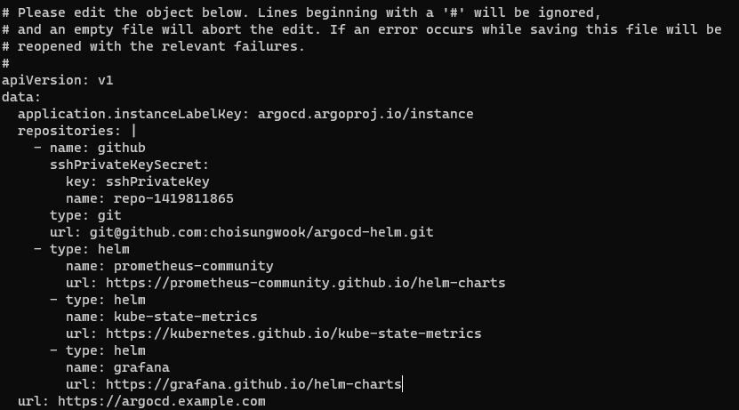

# 원본
* https://github.com/prometheus-community/helm-charts/tree/main/charts/kube-prometheus-stack

# 준비
* argocd-cm configmap리소스에 helm repo 추가
```sh
https://prometheus-community.github.io/helm-charts
https://kubernetes.github.io/kube-state-metrics
https://grafana.github.io/helm-charts
```

